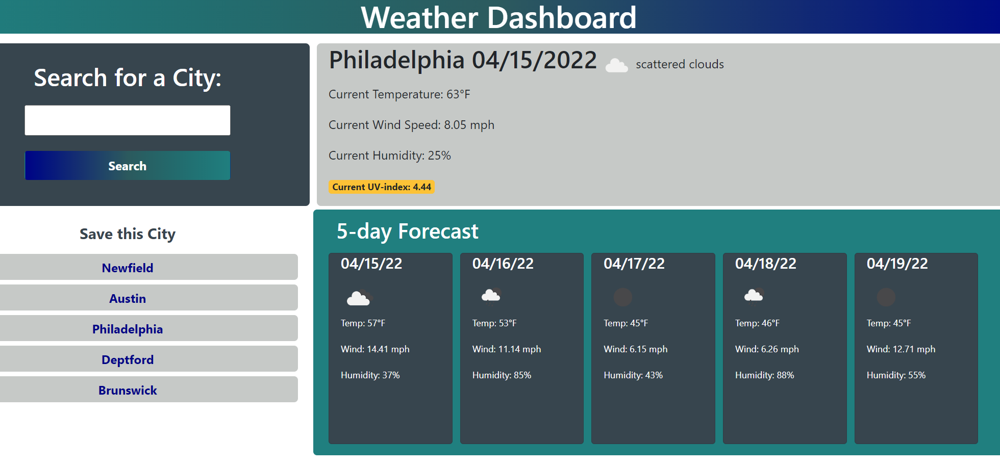

# Weather Dashboard

## About this Application

This application was made for user's who want to be able to view the current and future weather conditions of multiple cities so they can plan their trip accordingly.

This application was made using HTML, CSS, and javascript. I used web frameworks such as [moment.js](https://momentjs.com/) for easy date formatting within javascript and [bootstrap](https://getbootstrap.com/docs/3.4/css/) for CSS formatting.

## How To Use

* To use this application, simply search the city you are interested in.
* The application then uses [OpenWeather API](https://openweathermap.org/api) to search for the current and future weather conditions.
* If you would like to save the city to look up again later, hit the "Save This City" button that is diplayed after searching.
* The application will save the city to your machine's local storage, and add a button to search with ease later!

## Link to Deployed Application
[click here!](https://mrsdno.github.io/weather-dashboard/)

### Made by Christine Diienno 
### [christine@dno.dev](mailto: "christine@dno.dev")